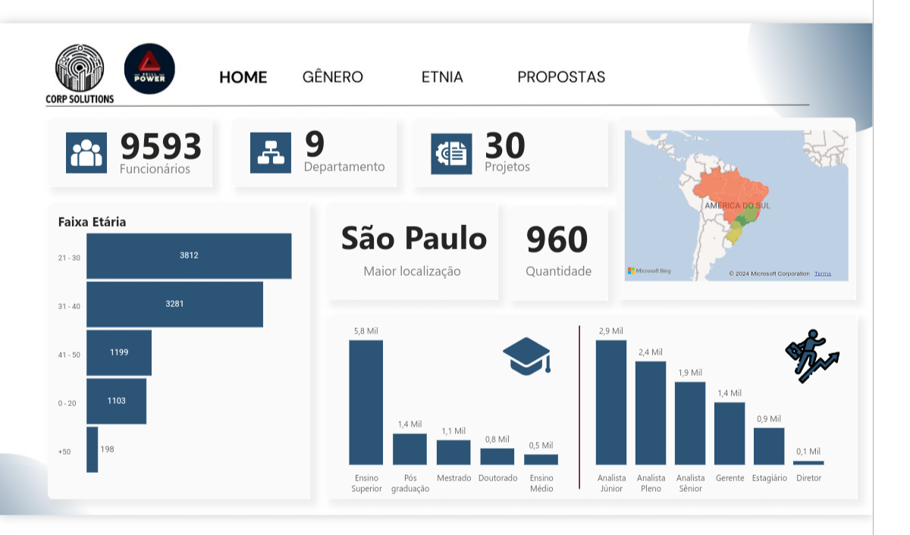
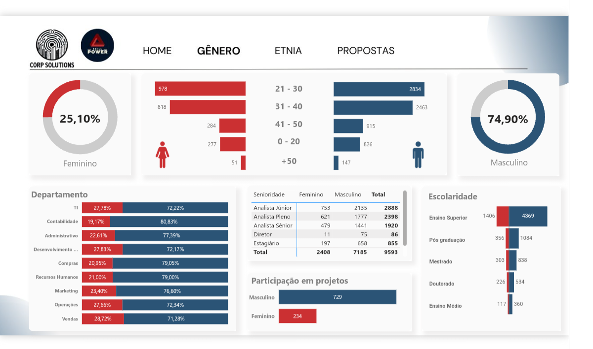
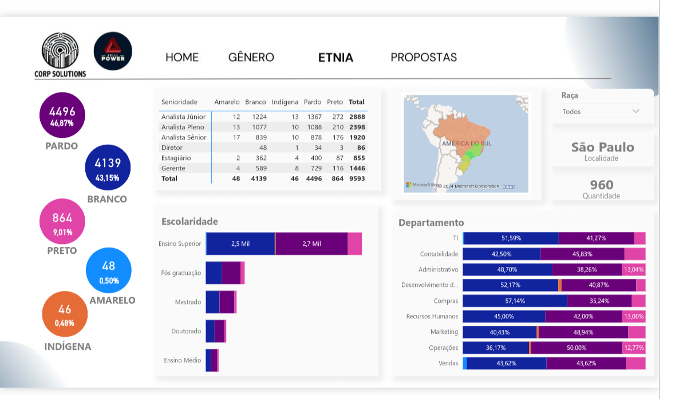
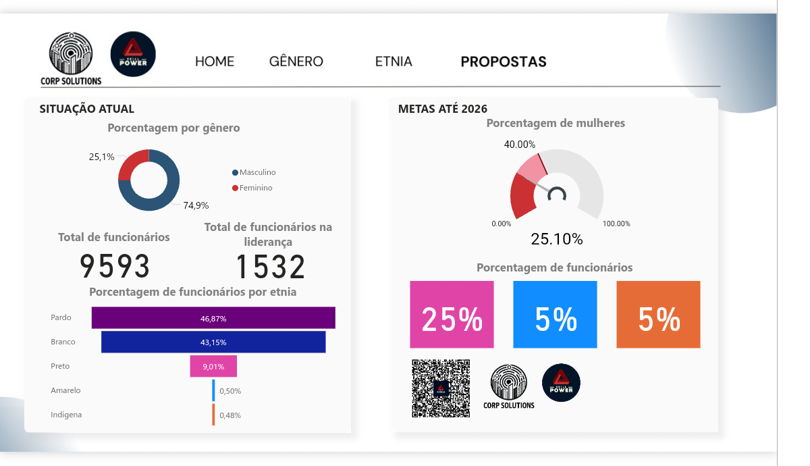

# **_SkillPower_**
### Projeto de Conclusão de Curso - Plataforma _ADA_
-------------------------------
Esse projeto foi desenvolvido com o objetivo de avaliar a base de dados de uma empresa fictícia cuja problemática principal é a falta de diversidade e através de uma análise exploratória dos dados da empresa propor soluções
## HomePage
#### Página inicial com contexto geral das empresas destacando a importância da diversidade

## Home
#### Análise geral dos funcionários 

## Gênero
#### Comparação dos números entre gêneros 

## Etnia
#### Avaliação da diversiadade racial

## Propostas
#### Conclusões finais dos dados, visando estratégias que tragam melhoria para o contexto de equidade 

